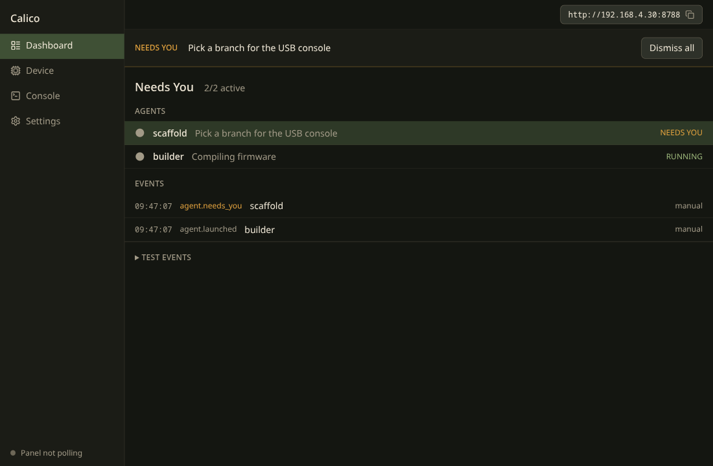
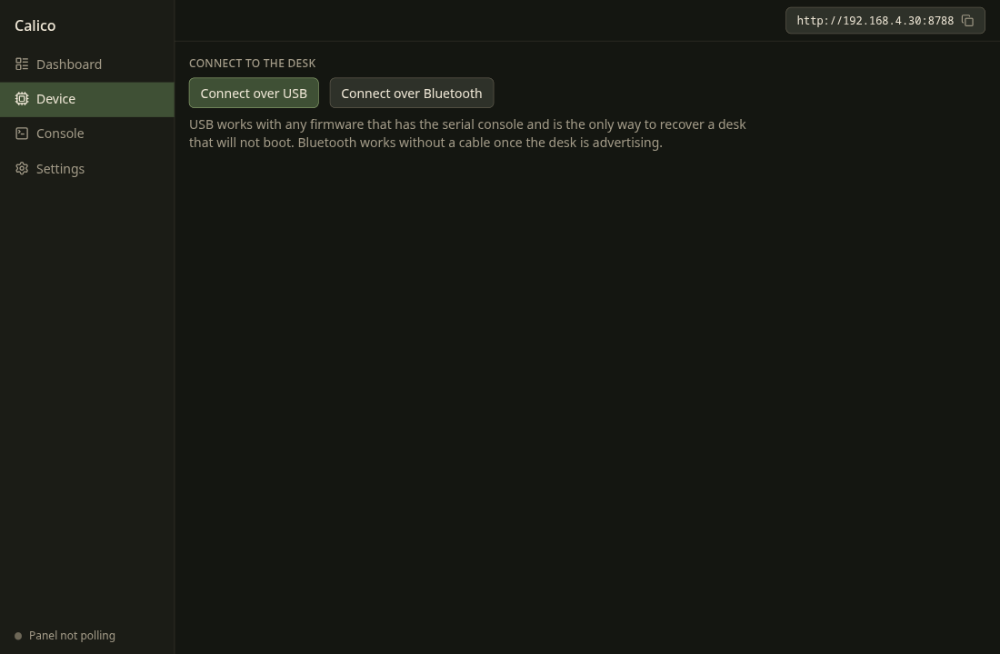

# Calico

Desktop companion and developer kit for ginger, an ESP32-S3 AMOLED desk panel that shows what your coding agents are doing. This repository holds the app, the panel firmware, and the agent kits.

> Status: alpha. v0.1 targets Linux.

## What it does

- Runs the companion server the panel polls (`/api/status` on port 8787 by default) and receives agent webhooks.
- Shows a dashboard of agents, events, and the panel's state.
- Sets up the panel over USB or Bluetooth: Wi-Fi (tested before it is saved), companion URL, token, reboot.
- Lives in the tray and starts at login, so the panel keeps working when the window is closed.




Planned: firmware flashing and a first-run wizard, a screen simulator built from the real firmware UI, more agent integrations, macOS and Windows.

## Repository layout

| Path                      | What it is                                                                                                                                                     |
| ------------------------- | -------------------------------------------------------------------------------------------------------------------------------------------------------------- |
| `src/`                    | The Electron app: companion server, tray, dashboard, device setup.                                                                                             |
| `firmware/`               | ESP-IDF firmware for the Waveshare ESP32-S3-Touch-AMOLED-2.16, with host tests and BLE/USB provisioning scripts. See [firmware/README.md](firmware/README.md). |
| `kits/ginger/`            | The Grok kit: the Grok Bot webhook guide and the original project README.                                                                                      |
| `tools/python-companion/` | The original Python companion and web UI, kept as the reference implementation the app's contract tests are captured from.                                     |
| `docs/`                   | Protocol docs and design history.                                                                                                                              |

The firmware, kit, and legacy companion arrived with their git history from the old grokbot-buddy repository. That history is not in `main` (the import was squash-merged), but it is kept at the tag [`grokbot-buddy-history`](https://github.com/newtosh/calico/tree/grokbot-buddy-history). Check it out to run `git log` or `git blame` on the original commits.

## Install

Linux packages (AppImage, deb, pacman) are attached to each [release](https://github.com/newtosh/calico/releases). Each release lists SHA-256 checksums and a build provenance attestation:

```bash
sha256sum -c SHA256SUMS
gh attestation verify Calico-*.AppImage --repo newtosh/calico
```

### Arch and derivatives, straight from the URL

Each release also carries a detached signature, so pacman can install the package without a separate download. Trust the release key once:

```bash
curl -fsSL https://raw.githubusercontent.com/newtosh/calico/main/packaging/calico-release.asc | sudo pacman-key --add -
sudo pacman-key --lsign-key A9F9FE8D26B68DD421EE52C8C491E349184FA884
```

Check that the fingerprint pacman-key prints is `A9F9 FE8D 26B6 8DD4 21EE  52C8 C491 E349 184F A884`. Then install or upgrade with:

```bash
sudo pacman -U https://github.com/newtosh/calico/releases/download/app-v0.1.4/Calico-0.1.4-x64.pacman
```

Replace the version in both places. pacman fetches the `.sig` next to the package by itself. Signatures start with 0.1.4. The key expires on 2029-10-08.

The tray icon needs a StatusNotifier host. KDE and most panels have one. GNOME needs the AppIndicator extension.

On Ubuntu 24.04 and later, install the deb. It adds an AppArmor profile so Chromium's sandbox works. The AppImage still runs there, but its launcher turns the sandbox off because Ubuntu blocks the user namespaces it needs, and it needs `libfuse2t64` installed. CI launches both on stock Ubuntu 24.04.

## Develop

Requires Node 22.12+ and pnpm 11.

```bash
pnpm install
pnpm dev
```

Checks: `pnpm lint && pnpm typecheck && pnpm test && pnpm build`. Firmware host tests: `firmware/host/run.sh`. See [CONTRIBUTING.md](CONTRIBUTING.md).

## Security

The companion listens on your LAN with no accounts. Anyone on the same network can read status. Writes require the bearer token when one is set. Do not port-forward it. Report vulnerabilities through [SECURITY.md](SECURITY.md).

## License

MIT. See [LICENSE](LICENSE).
