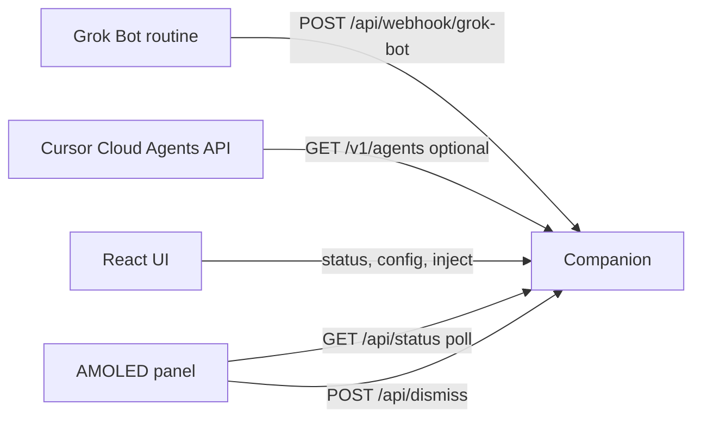

# Grok Desk Buddy — design

Date: 2026-10-02

Status: approved outline from Scaffold, with ambiguities resolved here.

Process note: the Scaffold handoff told this cloud agent to finish design, plan, implementation, and a pull request without further product questions unless one irreversible choice blocked the work. Stack and board stay locked. The choices below are the resolutions of the remaining ambiguities.

## Intent

Jon wants a LAN desk companion for the Waveshare ESP32-S3-Touch-AMOLED-2.16. The panel shows whether Grok Bot / Cursor agents are running, idle, or blocked. There is no Grok Bot device SDK, so a small companion process on the LAN is the bridge, the same role VibePulse’s tokenserver plays. A browser UI configures that bridge and can inject demo events. Success is a local demo without the board, a firmware project that polls the companion (or a documented build blocker), and a pull request against `main`. This does not replace VibePulse or XiaoZhi and does not talk to Xiaozhi cloud.

## Locked constraints

- Board: Waveshare ESP32-S3-Touch-AMOLED-2.16, 480×480, CO5300, CST9220, BSP `waveshare/esp32_s3_touch_amoled_2_16` `^2.0.1`, LVGL 9, ESP-IDF 5.4-shaped defaults from the official `02_lvgl_demo_v9` example.
- `companion/`: Python, ruff, black, type annotations, `pyproject.toml`. No third-party runtime dependencies.
- `web/`: TypeScript, React, Vite, ESLint, Prettier, `strict`, no `any`, one component per file, Tailwind only.
- No Docker. No voice ASR/TTS. No deploy. No merge.

## Approaches

1. **Stdlib companion, static React build, ESP-IDF poller (chosen).** One Python process owns state, the webhook, optional Cursor polling, and the built UI. The panel only GETs `/api/status`. Few moving parts, secrets stay off the device unless the user types a token into NVS.
2. **FastAPI companion.** Same routes, OpenAPI for free, extra packages to install and pin. The surface is four JSON routes. Not worth it.
3. **Panel calls Cursor and Grok directly.** Puts the API key on the microcontroller and skips the web config. Rejected: the product is a bridge.

## Architecture



The companion is the only writer of desk state. The panel and the browser are readers, plus the two writes named above.

## Desk state

An event is:

| Field | Rule |
| --- | --- |
| `type` | `agent.launched`, `agent.finished`, `agent.needs_you`, or `note` |
| `agent_id` | Required for the three agent types. Empty string allowed on `note`. |
| `title` | Display string, may be empty. |
| `message` | Display string, may be empty. |
| `source` | `grok-bot`, `cursor`, or `manual`. Default `grok-bot` on the webhook. |
| `id` | Server-assigned UUID. |
| `at` | Server-assigned UTC timestamp, `YYYY-MM-DDTHH:MM:SSZ`. |

Unknown `type` is a 400. Missing `agent_id` on an agent event is a 400.

Agents are upserted by `agent_id`:

- `agent.launched` → `running`. Title updates when the event title is non-empty.
- `agent.finished` → `idle`.
- `agent.needs_you` → `needs_you`.
- `note` appends an event and does not create or change an agent.

`phase` is `needs_you` if any agent is `needs_you`, else `running` if any agent is `running`, else `idle`. `needs_you` on the status document is true exactly when `phase` is `needs_you`.

`POST /api/dismiss` sets every `needs_you` agent back to `running` and appends a `note` event titled `Dismissed`. It does not delete history.

The store keeps the last 50 events. Older events drop off. Optional SQLite (`sqlite_path` non-empty) persists agents and events across restarts and reloads the same cap on startup. Empty `sqlite_path` means memory only.

`GET /api/status` returns:

```json
{
  "phase": "idle",
  "needs_you": false,
  "agents": [
    {"id": "a1", "title": "Scaffold", "status": "running", "updated_at": "2026-10-02T13:00:00Z"}
  ],
  "last_event": null,
  "events": []
}
```

`last_event` is the newest event or `null`. `events` is newest first.

## HTTP

Bind default `0.0.0.0:8787`. Implementation is `http.server.ThreadingHTTPServer`.

| Method | Path | Auth |
| --- | --- | --- |
| GET | `/api/status` | none |
| POST | `/api/webhook/grok-bot` | bearer if `webhook_token` is set |
| POST | `/api/dismiss` | bearer if `webhook_token` is set |
| GET | `/api/config` | none, secrets masked |
| PUT | `/api/config` | bearer if `webhook_token` is set |
| GET | `/` and other non-API paths | static files from `web/dist` |

Bearer means `Authorization: Bearer <token>`. A missing or wrong token on a protected route is 401 with `{"error": "unauthorized"}`. GET status stays open so the panel works before anyone types a token into NVS. The README states that anyone on the LAN can read status and that this PoC is not for a shared or public network.

CORS: `Access-Control-Allow-Origin: *`, methods `GET, POST, PUT, OPTIONS`, headers `Content-Type, Authorization`. Preflight returns 204.

Static: if `web/dist/index.html` exists, `/` serves it and other paths serve files under that directory, rejecting `..`. If the build is missing, `/` returns plain text telling the operator to build the web UI. API routes are never served as files.

Webhook body is JSON. Response 201 is the stored event. `source` defaults to `grok-bot`. Inject buttons send `source: "manual"`.

## Config

File default: `companion/data/config.json` (gitignored). Override path with `GROK_DESK_CONFIG`.

```json
{
  "bind_host": "0.0.0.0",
  "bind_port": 8787,
  "webhook_token": "",
  "cursor_api_key": "",
  "sqlite_path": "",
  "cursor_poll_seconds": 30
}
```

Environment overrides when set: `GROK_DESK_HOST`, `GROK_DESK_PORT`, `GROK_DESK_WEBHOOK_TOKEN`, `CURSOR_API_KEY`, `GROK_DESK_SQLITE`, `GROK_DESK_CURSOR_POLL_SECONDS`.

`GET /api/config` returns the non-secret fields plus `webhook_token_set` and `cursor_api_key_set` booleans. It never returns the token or the API key.

`PUT /api/config` merges. A secret key omitted stays as stored. A secret key present as `""` clears it. A non-empty string replaces it. Bind host and port apply on the next process start; the PUT response includes `"restart_required": true` when host or port changed. Other fields apply to the running process (token checks, sqlite path is not hot-swapped: changing `sqlite_path` also sets `restart_required`).

## Cursor poll

Runs only while `cursor_api_key` is non-empty, on a daemon thread, every `cursor_poll_seconds` (minimum 5).

`GET https://api.cursor.com/v1/agents?limit=20` with Basic auth, API key as the username and an empty password.

List items carry agent lifecycle, not “needs you”:

- `ACTIVE` → agent `running`, event `agent.launched`, source `cursor`
- `IDLE` or `ARCHIVED` → agent `idle`, event `agent.finished`, source `cursor`
- anything else → ignore

The poll never sets `needs_you`. That signal is the Grok Bot webhook. Re-applying an agent whose mapped status is unchanged does not append another event.

HTTP errors are logged and skipped. The demo does not require a key.

## Web UI

Vite + React 18 + Tailwind 4 (`@tailwindcss/vite`). Poll `/api/status` every 2 seconds.

Components, one per file:

- `StatusDashboard` — phase, last event, agent list, event list
- `NeedsYouBanner` — full-width banner when `needs_you`, button calls dismiss
- `AgentList` — rows of id, title, status
- `EventList` — newest events
- `ConfigForm` — bind host/port, token, Cursor key, sqlite path, poll seconds
- `InjectPanel` — four buttons: launched, finished, needs you, note

`App` composes them. Fetch helpers live in `api.ts` (not a component). No `any`. The Cursor key and webhook token inputs are write-only: placeholders say whether a value is already set.

## Firmware

ESP-IDF project `firmware/`, target `esp32s3`, project name `grok_desk_buddy`.

Dependencies in `main/idf_component.yml`:

- `waveshare/esp32_s3_touch_amoled_2_16` `^2.0.1`
- `lvgl/lvgl` `9.*`
- `espressif/cjson` (managed)

`sdkconfig.defaults` copies the flash, PSRAM, and LVGL font flags from Waveshare’s `02_lvgl_demo_v9` that the panel needs (16 MB flash, octal PSRAM, Montserrat 16–24). Partition table matches that example (factory 8 MB).

Boot:

1. `nvs_flash_init`, then `bsp_display_start`.
2. NVS namespace `desk`: `ssid`, `pass`, `url` (default `http://192.168.1.10:8787`), `token`.
3. If `ssid` is empty, show the settings screen and do not connect.
4. Otherwise connect Wi-Fi and poll `GET {url}/api/status` every 2 seconds with `esp_http_client`. Optional header `Authorization: Bearer {token}` when `token` is non-empty.
5. Parse into `desk_view_t` and refresh LVGL under `bsp_display_lock`.

`desk_view_t` is pure C with no IDF types, in `firmware/main/desk_view.c`. A host `gcc` test feeds it status JSON. The firmware and the test share that file.

Panel (480×480):

- Phase word: IDLE, RUNNING, or NEEDS YOU.
- Last event title and message.
- Count of agents whose status is `running`.
- When `needs_you` is true, a full-screen takeover. A tap calls `POST {url}/api/dismiss` and returns to the tiles after the next poll.
- A Settings control opens LVGL text areas for SSID, password, companion URL, and token, saved to NVS. Saving restarts Wi-Fi association.
- A Mic control sets the message line to `Voice not in this PoC`. No I2S, no ES7210 capture.

Host preview: `firmware/simulator/index.html`, a 480×480 page that polls the same status URL (query `?base=` or default `http://127.0.0.1:8787`). The companion does not need to serve it. Open the file in a browser. This is the path used when ESP-IDF is not installed.

Flash (documented in `firmware/README.md`): ESP-IDF 5.4, `idf.py set-target esp32s3`, `idf.py build`, `idf.py -p PORT flash monitor`. If `idf.py` is absent in an environment, that README states the blocker and points at the simulator and the `desk_view` host test. The project files stay valid for the board.

## Docs and repo root

- `README.md` — diagram, quickstart (companion, web, flash), security paragraph, how this sits next to VibePulse / XiaoZhi. Grok Bot wiring summarized in under a page and pointed at the longer guide.
- `docs/grok-bot-integration.md` — routine POSTs on launch and finish, the JSON schema, dismiss, what this does not replace.
- `LICENSE` MIT.
- `.gitignore` for Python, Node, ESP-IDF build trees, `companion/data/`, `.env`.
- `.env.example` with the environment variables above, empty secrets.

## Error handling

- Malformed JSON: 400 `{"error": "bad json"}`.
- Wrong method: 405.
- Companion keeps serving if a single Cursor poll fails.
- Panel keeps the last good view if a poll fails, and shows `link down` in the phase line after three consecutive failures. Settings stay available.

## Testing

- pytest for the store, HTTP routes, config merge, and Cursor mapping. Cursor HTTP is a fake opener, not the network.
- `gcc` host test for `desk_view_from_json`.
- `npm run build` plus `tsc --noEmit` for the web app. ESLint has to pass.
- ruff and black pass on `companion/`.
- Manual: inject a needs-you event, see `/api/status` and the dashboard banner change, dismiss, see it clear.

## Out of scope

Voice pipelines, BLE, IMU, battery UI, Xiaozhi accounts, Docker, authentication beyond the optional bearer, multi-user, and deploying the companion.
