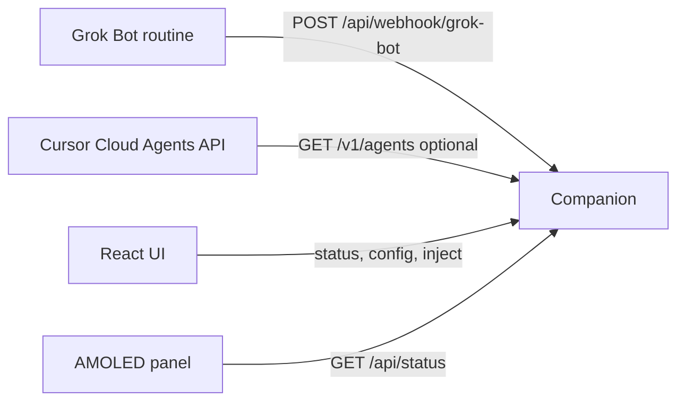

# Grok desk buddy

A LAN desk companion for Jon’s Waveshare ESP32-S3-Touch-AMOLED-2.16. The panel shows whether Grok Bot or Cursor agents are running, idle, or blocked. A small Python process on the LAN is the bridge, because Grok Bot has no device SDK. The browser UI configures that bridge and can inject demo events without the board.

This sits next to [VibePulse](https://github.com/niclasvestlund-YT/vibepulse) and [XiaoZhi](https://github.com/78/xiaozhi-esp32). It does not replace either, and it does not use a Xiaozhi cloud account.



## Quickstart

From the repo root, with Python 3.11+ and Node 22:

```bash
cd web && npm install && npm run build && cd ..
PYTHONPATH=companion/src python3 -m grok_desk_buddy
```

Open http://127.0.0.1:8787. The Inject buttons post `agent.launched`, `agent.finished`, `agent.needs_you`, and `note`. The dashboard polls `/api/status` every two seconds.

Dev UI with live reload, while the companion is already running:

```bash
cd web && npm run dev
```

Vite proxies `/api` to port 8787.

Optional Cursor list polling starts when `CURSOR_API_KEY` is set. It maps `ACTIVE` to running and `IDLE` / `ARCHIVED` to idle. It never raises NEEDS YOU. That signal is only the webhook. Copy `.env.example` and export the variables you need, or set them in the web config form. Secrets go to `companion/data/config.json`, which is gitignored.

## Flash the panel

See [firmware/README.md](firmware/README.md). ESP-IDF 5.5, target `esp32s3`, BSP `waveshare/esp32_s3_touch_amoled_2_16`. Without a toolchain, run the host tests and open `firmware/simulator/index.html`.

## Grok Bot

Point a Scaffold routine at the companion on launch and on finish. Optional `color`, `shape`, and `icon` on that webhook are what make each session distinct on the dashboard and the panel. Full schema and a curl example: [docs/grok-bot-integration.md](docs/grok-bot-integration.md).

```bash
curl -s -X POST http://127.0.0.1:8787/api/webhook/grok-bot \
  -H 'Content-Type: application/json' \
  -d '{"type":"agent.needs_you","agent_id":"scaffold","title":"Scaffold","message":"Pick one"}'
```

If a webhook bearer token is set, add `-H "Authorization: Bearer $GROK_DESK_WEBHOOK_TOKEN"`. `GET /api/status` stays open so the panel can poll before anyone types a token into NVS.

## Panel URL and token

Wi-Fi networks can be added or removed over USB with `scripts/provision-wifi.py add` and `scripts/provision-wifi.py remove` (see [firmware/README.md](firmware/README.md)). The on-device keyboard still works. The panel keeps every saved network and, at boot, joins the saved SSID that is in range. After the board is joined and a status poll succeeds, the dashboard section **Panel config** (or `PUT /api/panel`) stores a companion URL and bearer token on the companion. The same `GET /api/status` the panel already polls then includes:

```json
"panel": {"url": "http://192.168.4.30:8787", "token": "desk-secret"}
```

If either value differs from the global NVS url and token, the firmware writes those two fields and restarts. It does not open a port, and it does not change Wi-Fi or the saved network list. `PUT /api/panel` rejects `ssid`, `password`, and the other Wi-Fi keys. Clear removes the object. Values already stored on the panel stay until the next different push.

A failed poll does not apply the push. While the panel shows `link down`, the dashboard has only stored the desired config. Use the browser token field when the companion has a webhook token; panel writes use that same check.

## Security

Bind is `0.0.0.0:8787` so a phone or the panel on the same LAN can connect. There is no account system. Anyone on the LAN can read status. While a panel push is stored, that status body includes the panel bearer token, because the poll is unauthenticated. Clear it after the panel restarts if you do not want the token left there. Writes (webhook, dismiss, config, panel) require the bearer token only when one is configured. Do not port-forward this process and do not put it on a shared network you do not trust. The token is a shared LAN secret, not a user login.

## Tests

```bash
cd companion && python3 -m pytest && python3 -m ruff check src tests && python3 -m black --check src tests
cd ../web && npm test -- --run && npm run build
gcc -Wall -Werror -I firmware/main firmware/host/test_desk_view.c firmware/main/desk_view.c -o /tmp/test_desk_view && /tmp/test_desk_view
gcc -Wall -Werror -I firmware/main firmware/host/test_wifi_store.c firmware/main/wifi_store.c -o /tmp/test_wifi_store && /tmp/test_wifi_store
```

## License

MIT. See [LICENSE](LICENSE).
